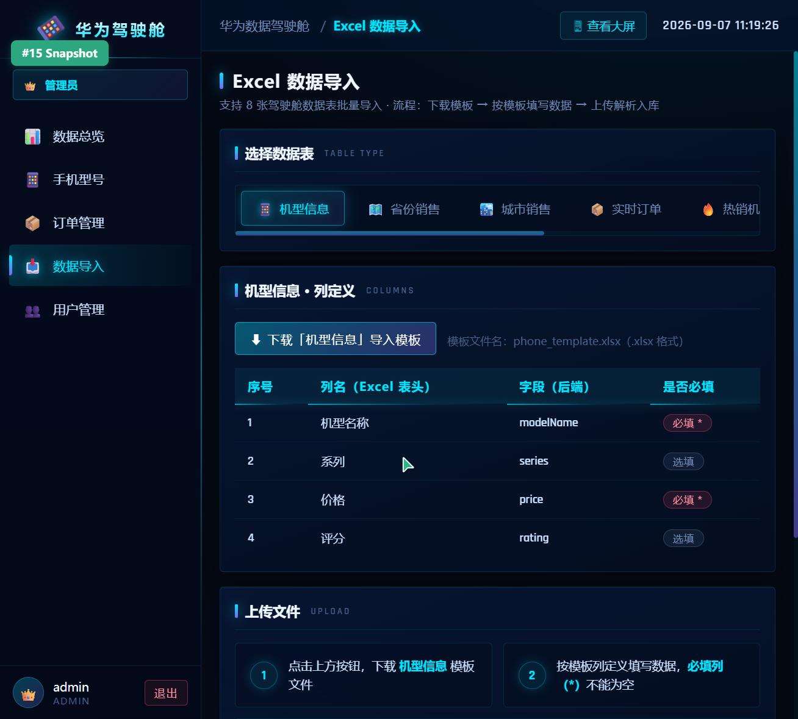

# 华为手机全息数据驾驶舱

> 华为品牌手机业务数据可视化平台（陕西省业务为主）：科技感全息数据大屏 + 两层权限管理后台 + AI 智能分析（火山方舟·豆包）


---

## 目录

- [项目简介](#项目简介)
- [界面预览](#界面预览)
- [功能特性](#功能特性)
- [技术架构](#技术架构)
- [项目结构](#项目结构)
- [快速开始](#快速开始)
- [配置说明](#配置说明)
- [API 接口概览](#api-接口概览)
- [Excel 批量导入](#excel-批量导入)
- [AI 能力说明](#ai-能力说明)
- [数据生成与爬虫](#数据生成与爬虫)
- [常见问题 FAQ](#常见问题-faq)

---

## 项目简介

本项目是一个面向**华为终端手机业务**（以陕西省为主要业务区域）的全栈数据可视化平台，包含三大部分：

1. **全息数据大屏** —— 深色科技风大屏，实时展示销售额、订单、用户、流量等核心指标，配套粒子星空、矩阵雨、全息扫描线等全套动效与 Web Audio 程序化音频
2. **管理后台** —— 基于 JWT 的两层权限体系（管理员 / 商家），支持手机型号、订单、用户等业务的增删改查，以及 8 类业务表的 Excel 批量导入
3. **AI 智能分析** —— 接入火山方舟（豆包大模型），提供 AI 对话助手、自然语言查数（NL2SQL）、智能预警、一键分析报告四大能力

**演示数据**：内置 30 天陕西省为主的仿真业务数据（西安领跑、真实华为机型定价、含周末效应），开箱即用。

---

## 界面预览

| 全息数据大屏 | 登录页 |
|:---:|:---:|
|  |  |

| 管理后台 | Excel 数据导入 |
|:---:|:---:|
|  |  |

---

## 功能特性

### 1. 全息数据大屏

| 模块 | 说明 |
|------|------|
| 核心指标卡 | 今日订单 / 新增用户 / 访问量 / 转化率，数字滚动 + sparkline 迷你趋势 |
| 中央主视觉 | 销售额超大数字翻牌动画 + 环比增长 |
| 双地图 | 陕西省 10 地市热力（默认）⇄ 全国 31 省视图切换，涟漪散点 + 飞线动画 |
| 热销机型 TOP10 | 横向条形榜 |
| 流量来源分析 | 旭日图（两级分类） |
| 用户画像 | 多维环形图 |
| 销售趋势 | 30 日趋势折线图 |
| 实时订单 | 底部横向跑马灯轮播（速度已调至便于观察） |
| 全套动效 | 粒子星空背景、矩阵雨、全息扫描线、故障字标题、鼠标粒子拖尾、面板霓虹边框 |
| 音频系统 | Web Audio 程序化合成：科技氛围背景音 + 按键音 + 交互反馈音 + Ducking 自动混音 |

### 2. AI 智能分析（火山方舟 · 豆包）

| 能力 | 说明 |
|------|------|
| AI 对话助手 | 注入实时大屏数据上下文，流式打字机输出 |
| 自然语言查询 | 提问 → LLM 生成 SQL → 白名单校验 → 执行 → 返回图表数据 + 中文解读 |
| 智能预警 | 规则引擎检测环比异常 → 弹窗 + 警示音 → AI 生成业务建议 |
| 一键分析报告 | 生成可下载的 HTML 分析报告 |

### 3. 管理后台（两层权限）

| 能力 | 管理员（ADMIN） | 商家（MERCHANT） |
|------|:---:|:---:|
| 数据大屏 | 全量 | — |
| 手机型号管理 | 增删改查 | 只读 |
| 订单管理 | 全部字段 + 删除 | 金额隐藏 + 可改状态 |
| 用户管理 | 可见 | 不可见 |
| 统计金额 | 可见 | 隐藏 |
| Excel 导入 | 可用 | 不可用 |

### 4. Excel 批量导入

支持 8 类业务表，逐行校验、错误定位、模板下载，详见 [Excel 批量导入](#excel-批量导入)。

---

## 技术架构

```
┌─────────────────────────────────────────────────────────┐
│                    前端 holo-cockpit-frontend             │
│          Vue 3 + Vite 5 + Vue Router + Axios             │
│  ┌──────────────────┐      ┌──────────────────────────┐  │
│  │   全息数据大屏     │      │        管理后台           │  │
│  │  ECharts 5 图表   │      │  登录 / CRUD / 数据导入    │  │
│  │  Canvas 动效粒子  │      │  两层权限路由守卫          │  │
│  │  Web Audio 音频   │      │  Excel 上传 / 模板下载     │  │
│  └──────────────────┘      └──────────────────────────┘  │
│              Vite DevServer :3000  ──/api 代理──►         │
└──────────────────────────────┬──────────────────────────┘
                               │ HTTP / JSON (JWT Bearer)
┌──────────────────────────────▼──────────────────────────┐
│                  后端 holo-cockpit-backend                │
│              Spring Boot 2.7.18 (Java 8+)                │
│  ┌─────────┐ ┌──────────────┐ ┌─────────────────────┐   │
│  │JWT 认证  │ │ MyBatis-Plus │ │   EasyExcel 3.3     │   │
│  │角色权限   │ │  CRUD / 分页  │ │  Excel 解析 / 生成   │   │
│  └─────────┘ └──────────────┘ └─────────────────────┘   │
│  ┌─────────────────────┐  ┌──────────────────────────┐   │
│  │  Cockpit 大屏数据    │  │  ArkClient 火山方舟       │   │
│  │  Admin 后台管理       │  │  (OpenAI 兼容 / 流式)     │   │
│  └─────────────────────┘  └──────────────────────────┘   │
└──────────────────────────────┬──────────────────────────┘
                               │ JDBC
                    ┌──────────▼──────────┐
                    │  MySQL 5.6+         │
                    │  库：huawei_cockpit  │
                    │  12 张业务表         │
                    └─────────────────────┘
```

**技术栈清单**

| 层 | 技术 |
|----|------|
| 前端框架 | Vue 3.4（Composition API）+ Vue Router 4 |
| 构建工具 | Vite 5 |
| 可视化 | ECharts 5 + echarts-gl |
| 网络 | Axios（自动携带 JWT） |
| 后端框架 | Spring Boot 2.7.18 |
| ORM | MyBatis-Plus 3.5.3 |
| 认证 | JWT（jjwt）+ Servlet Filter |
| Excel | Alibaba EasyExcel 3.3.4 |
| AI | 火山方舟 OpenAI 兼容接口（doubao-seed 系列） |
| 数据库 | MySQL 5.6+ |
| 工具 | Hutool、Lombok |

---

## 项目结构

```
.
├── start.bat                    # Windows 一键启动（自动安装依赖）
├── start.sh                     # macOS / Linux 一键启动
├── README.md                    # 本文件
├── 华为手机全息数据驾驶舱-项目介绍书.docx
│
├── holo-cockpit-backend/        # 后端服务（Spring Boot，端口 8080）
│   ├── mvnw.cmd                 # Maven Wrapper（无需安装 Maven）
│   ├── pom.xml
│   └── src/main/
│       ├── java/com/holocockpit/
│       │   ├── HoloCockpitApplication.java
│       │   ├── common/          # Result 统一响应
│       │   ├── config/          # CORS / MybatisPlus / JWT 过滤器
│       │   ├── controller/      # Auth / Cockpit / Admin / Import / Ai
│       │   ├── entity/          # 15 个实体
│       │   ├── mapper/          # MyBatis-Plus Mapper
│       │   └── service/         # 业务逻辑 + ArkClient
│       └── resources/
│           ├── application.yml              # 主配置（密码/Key 已脱敏）
│           └── application-local.example.yml # 本地私密配置模板
│
├── holo-cockpit-frontend/       # 前端服务（Vite，端口 3000）
│   ├── package.json
│   ├── vite.config.js           # 端口 3000 + /api 代理到 8080
│   └── src/
│       ├── api/                 # Axios 封装
│       ├── components/          # 大屏图表组件（9 个）
│       ├── layouts/AdminLayout.vue
│       ├── router/              # 路由 + 登录守卫
│       └── views/
│           ├── Cockpit.vue      # 全息数据大屏
│           ├── Login.vue        # 登录页
│           └── admin/           # 后台页面（8 个）
│
├── sql/
│   └── init.sql                 # 建库建表 + 30 天仿真数据
│
├── crawler/
│   └── vmall_crawler.py         # 华为商城机型价格爬虫（可选）
│
├── tools/
│   └── generate_sql.js          # 仿真数据生成器（可选）
│
├── holo-music/                  # 背景音乐素材
└── docs/
    └── images/                  # 界面截图
```

---

## 快速开始

### 环境要求

| 依赖 | 版本要求 | 说明 |
|------|---------|------|
| JDK | 8 及以上（推荐 17） | 后端运行 |
| Node.js | 16 及以上（推荐 18/20） | 前端运行 |
| MySQL | 5.6 及以上 | 数据存储 |
| Maven | 无需安装 | 项目自带 Maven Wrapper |

### 方式一：一键启动（Windows，推荐）

```bash
git clone https://github.com/WRY907/studious-octo-happiness.git
cd studious-octo-happiness
```

双击 `start.bat`，脚本会自动完成：

1. ✅ 检查 Java / Node 环境
2. ⏳ 前端依赖未安装时自动 `npm install`（国内镜像加速）
3. 🗄️ 检测数据库未初始化时提示一键导入 `sql/init.sql`
4. 🚀 新窗口启动后端（8080）与前端（3000）
5. 🌐 自动打开浏览器访问大屏

### 方式二：一键启动（macOS / Linux）

```bash
chmod +x start.sh
./start.sh
```

### 方式三：手动启动

**1. 初始化数据库**

```bash
mysql -uroot -p < sql/init.sql
```

> 自动创建 `huawei_cockpit` 库：12 张表 + 30 天陕西为主的业务数据 + 真实华为机型。

**2. 配置数据库密码**（见 [配置说明](#配置说明)）

**3. 启动后端（端口 8080）**

```bash
cd holo-cockpit-backend
mvnw.cmd spring-boot:run        # Windows
./mvnw spring-boot:run          # macOS / Linux
```

> 首次启动会自动下载 Maven 依赖，请耐心等待。

**4. 启动前端（端口 3000）**

```bash
cd holo-cockpit-frontend
npm install --registry=https://registry.npmmirror.com
npm run dev
```

### 访问地址与默认账号

| 入口 | 地址 |
|------|------|
| 数据大屏 | http://localhost:3000/ |
| 管理后台登录 | http://localhost:3000/#/login |

| 角色 | 账号 | 密码 |
|------|------|------|
| 管理员 | admin | admin123 |
| 商家 | merchant | merchant123 |

> 页面展示流程：先登录，登录成功后才能进入全息数据大屏。

---

## 配置说明

后端配置文件为 `holo-cockpit-backend/src/main/resources/application.yml`，其中**数据库密码与 AI API Key 均已脱敏**，请按以下任一方式注入真实值：

### 方式一：本地私密配置文件（推荐）

```bash
cd holo-cockpit-backend
# 复制模板（模板已提交到仓库）
cp src/main/resources/application-local.example.yml application-local.yml
# 编辑 application-local.yml，填入你的真实密码与 API Key
```

`application-local.yml` 已被 `.gitignore` 忽略，**不会提交到仓库**，安全。

### 方式二：环境变量

| 环境变量 | 说明 | 默认值 |
|---------|------|--------|
| `DB_USERNAME` | MySQL 用户名 | root |
| `DB_PASSWORD` | MySQL 密码 | 123456 |
| `ARK_API_KEY` | 火山方舟 API Key | （空） |

### 火山方舟 API Key

AI 功能依赖火山方舟大模型服务，API Key 获取地址：https://console.volcengine.com/ark

- 不配置 Key 时，AI 相关功能会提示「AI 服务暂时不可用」，**其余功能不受影响**
- 模型可在 `application.yml` 的 `ark.model` 中调整

---

## API 接口概览

所有接口以 `/api` 为前缀，除登录外均需携带 `Authorization: Bearer <token>`。

### 认证

| 方法 | 路径 | 说明 |
|------|------|------|
| POST | `/api/auth/login` | 登录，返回 JWT + 角色 |

### 大屏数据

| 方法 | 路径 | 说明 |
|------|------|------|
| GET | `/api/cockpit/all` | 大屏全量数据（8 组） |
| GET | `/api/cockpit/region` | 省份销售 |
| GET | `/api/cockpit/city` | 城市销售 |

### 管理后台

| 方法 | 路径 | 说明 |
|------|------|------|
| GET / POST | `/api/admin/phones` | 手机型号 列表 / 新增 |
| PUT / DELETE | `/api/admin/phones/{id}` | 手机型号 修改 / 删除 |
| GET | `/api/admin/orders` | 订单列表 |
| PUT | `/api/admin/orders/{id}/status` | 修改订单状态 |
| DELETE | `/api/admin/orders/{id}` | 删除订单 |
| GET | `/api/admin/users` | 用户列表（仅管理员） |
| GET | `/api/admin/stats` | 统计数据（仅管理员） |

### Excel 导入（仅管理员）

| 方法 | 路径 | 说明 |
|------|------|------|
| GET | `/api/admin/import/meta` | 支持导入的表清单 |
| GET | `/api/admin/import/{table}/template` | 下载某表的标准模板 |
| POST | `/api/admin/import/{table}` | 上传 Excel 并导入 |

### AI 能力

| 方法 | 路径 | 说明 |
|------|------|------|
| POST | `/api/ai/chat` | AI 对话（SSE 流式） |
| POST | `/api/ai/query` | 自然语言查数 |
| GET | `/api/ai/alerts` | 智能预警列表 |
| POST | `/api/ai/alerts/check` | 触发预警检测 |
| POST | `/api/ai/report` | 生成分析报告 |

---

## Excel 批量导入

管理后台「数据导入」页面支持 8 类业务表的 Excel 批量导入：

| 表标识 | 说明 | 必填列 |
|--------|------|--------|
| phone | 手机型号 | 机型名称、价格 |
| region | 省份销售 | 省份、销售额、日期 |
| city | 城市销售 | 城市、销售额、日期 |
| order | 实时订单 | 订单号、机型名称、金额 |
| hot | 热销机型 | 机型名称、销售额 |
| traffic | 流量来源 | 一级分类、二级来源 |
| profile | 用户画像 | 类型、名称 |
| trend | 销售趋势 | 日期、销售额 |

**使用流程**：

1. 在「数据导入」页面选择目标表，点击**下载模板**（含示例数据）
2. 按模板格式填写数据
3. 拖拽上传 Excel 文件（单文件上限 20MB）
4. 查看导入结果

**校验规则**：

- 逐行校验：必填项 / 数字格式 / 日期格式
- 错误行自动跳过，并显示**行号 + 原因**
- 机型名重复自动更新价格；趋势日期重复自动覆盖
- 仅管理员角色可用

---

## AI 能力说明

| 能力 | 实现方式 |
|------|---------|
| AI 对话助手 | 后端将大屏实时数据注入 System Prompt，调用豆包模型，SSE 流式返回前端打字机渲染 |
| 自然语言查询 | LLM 根据表结构生成 SQL → **白名单校验**（仅允许 SELECT）→ 执行 → 返回图表数据 + 中文解读 |
| 智能预警 | 规则引擎检测环比异常（如销售额环比下跌超阈值）→ 前端弹窗 + 警示音 → AI 生成业务建议 |
| 一键分析报告 | 汇总核心指标与趋势，AI 生成完整分析，输出可下载的 HTML 报告 |

---

## 数据生成与爬虫

### 重新生成仿真数据

```bash
node tools/generate_sql.js          # 重新生成 sql/init.sql
mysql -uroot -p < sql/init.sql      # 重新导入
```

生成规则：陕西省占 55%（西安 38% 领跑）、真实机型定价、30 天趋势含周末效应。

### 爬虫刷新真实机型（可选）

```bash
pip install requests beautifulsoup4 pymysql
export DB_PASSWORD=你的密码
python crawler/vmall_crawler.py
```

爬取华为商城公开页的机型 / 价格 / 评分，更新 `phone_model` 表。

**合规边界**：仅爬取公开页面、控制请求频率（2~5 秒/次）、不触碰登录接口。

---

## 常见问题 FAQ

**Q：后端启动报数据库连接失败？**
A：检查 MySQL 服务是否启动、`application-local.yml` 中密码是否正确、`huawei_cockpit` 库是否已执行 `sql/init.sql` 初始化。

**Q：AI 提问显示「AI 服务暂时不可用」？**
A：未配置火山方舟 API Key。按 [配置说明](#配置说明) 填入 `ARK_API_KEY` 后重启后端即可。

**Q：前端依赖安装慢 / 失败？**
A：使用国内镜像 `npm install --registry=https://registry.npmmirror.com`（start.bat 已默认使用）。

**Q：端口被占用？**
A：后端 8080 / 前端 3000。修改 `application.yml` 的 `server.port` 与 `vite.config.js` 的 `server.port`（注意同步修改代理目标）。

**Q：登录后白屏？**
A：确认后端已完全启动（日志出现 `Started HoloCockpitApplication`），前端代理依赖后端 8080 端口。

**Q：MySQL 8.x 能用吗？**
A：可以。驱动为 `mysql-connector-j`，兼容 5.6 ~ 8.x。若密码认证失败，确认用户密码插件为 `mysql_native_password` 或在连接串中已有 `allowPublicKeyRetrieval=true`（已默认开启）。

---

## 声明

- 本项目为课程设计 / 学习交流用途，数据为仿真生成，与华为公司真实业务数据无关
- 「华为」及相关商标归华为技术有限公司所有，本项目仅作教学演示
- 请勿将真实 API Key、数据库密码提交到公共仓库

---

<p align="center">Made with 💡 by 华为手机全息数据驾驶舱项目小组</p>
